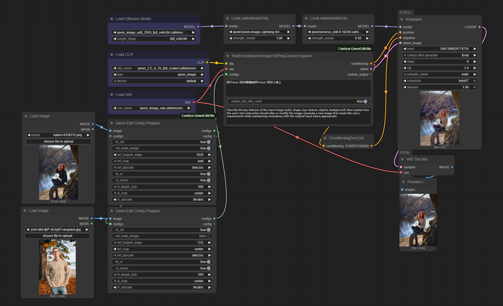

# Comfyui-QwenEditUtils

A collection of utility nodes for Qwen-based image editing in ComfyUI.

## Example

  
  

You can find complete ComfyUI workflow examples in the following files:
- [`qwen edit custom simple.json`](qwen edit custom simple.json) - demonstrates basic usage of the custom node with simple configuration
- [`qwen edit custom full.json`](qwen edit custom full.json) - demonstrates advanced usage with full configuration options

## Update Log
### v2.0.3
- Added QwenEditAdaptiveLongestEdge for easier to get the best longest edge of the image.
### v2.0.0
- Added TextEncodeQwenImageEditPlusCustom_lrzjason for highly customized image editing.
- Added QwenEditConfigPreparer, QwenEditConfigJsonParser for creating image configurations.
- Added QwenEditOutputExtractor for extracting outputs from the custom node.
- Added QwenEditListExtractor for extracting items from lists.
- Added CropWithPadInfo for cropping images with pad information.

## Node

### TextEncodeQwenImageEditPlus 小志Jason(xiaozhijason)

This node provides text encoding functionality with reference image support for Qwen-based image editing workflows. It allows you to encode prompts while incorporating up to 5 reference images for more controlled image generation.

#### Inputs

- **clip**: The CLIP model to use for encoding
- **prompt**: The text prompt to encode
- **vae** (optional): The VAE model for image encoding
- **image1** (optional): First reference image for image editing
- **image2** (optional): Second reference image for image editing
- **image3** (optional): Third reference image for image editing
- **image4** (optional): Fourth reference image for image editing
- **image5** (optional): Fifth reference image for image editing
- **enable_resize** (optional): Enable automatic resizing of the reference image for VAE encoding
- **enable_vl_resize** (optional): Enable automatic resizing of the reference image for VL encoding
- **llama_template** (optional): Custom Llama template for image description and editing instructions

#### Outputs

- **CONDITIONING**: The encoded conditioning tensor
- **image1**: The processed first reference image
- **image2**: The processed second reference image
- **image3**: The processed third reference image
- **image4**: The processed fourth reference image
- **image5**: The processed fifth reference image
- **LATENT**: The encoded latent representation of the first reference image

#### Behavior

- Encodes text prompts using CLIP with optional reference image guidance
- Supports up to 5 reference images for complex editing tasks
- Automatically resizes reference images to optimal dimensions for both VAE and VL encoding
- Integrates with VAE models to encode reference images into latent space
- Supports custom Llama templates for more precise image editing instructions
- Processes images separately for VAE encoding (1024x1024) and VL encoding (384x384)
- Returns individual processed images for more flexible workflow connections

### TextEncodeQwenImageEditPlusAdvance 小志Jason(xiaozhijason)

This advanced node provides enhanced text encoding functionality with reference image support for Qwen-based image editing workflows. It offers more precise control over image resizing and supports flexible image input configurations with separate processing for VAE and VL encoding.

#### Inputs

- **clip**: The CLIP model to use for encoding
- **prompt**: The text prompt to encode
- **vae** (optional): The VAE model for image encoding
- **vl_resize_image1** (optional): First reference image for VL encoding with resizing
- **vl_resize_image2** (optional): Second reference image for VL encoding with resizing
- **vl_resize_image3** (optional): Third reference image for VL encoding with resizing
- **not_resize_image1** (optional): First reference image without VL resizing
- **not_resize_image2** (optional): Second reference image without VL resizing
- **not_resize_image3** (optional): Third reference image without VL resizing
- **target_size** (optional): Target size for VAE encoding (options: 1024, 1344, 1536, 2048, 768, 512)
- **target_vl_size** (optional): Target size for VL encoding (default: 384)
- **upscale_method** (optional): Method for upscaling images (options: "lanczos", "bicubic", "area")
- **crop** (optional): Cropping method (options: "center", "disabled")
- **instruction** (optional): Custom instruction for image editing

#### Outputs

- **CONDITIONING**: The encoded conditioning tensor
- **LATENT**: The encoded latent representation of the first reference image
- **target_image1**: The processed first target reference image
- **target_image2**: The processed second target reference image
- **target_image3**: The processed third target reference image
- **vl_resized_image1**: The first VL-resized reference image
- **vl_resized_image2**: The second VL-resized reference image
- **vl_resized_image3**: The third VL-resized reference image

#### Behavior

- Provides advanced text encoding with separate control over VAE and VL image processing
- Supports 3 reference images with different resize behaviors
- Offers multiple target size options for more flexible image processing
- Maintains separate image outputs for VAE-encoded and VL-resized images
- Provides enhanced upscale and crop controls for optimal image processing
- Integrates with custom instructions for tailored image editing

### TextEncodeQwenImageEditPlusPro 小志Jason(xiaozhijason)

This professional node provides the most flexible text encoding functionality with reference image support for Qwen-based image editing workflows. It offers fine-grained control over which images are VL-resized and includes a main image designation for focused conditioning.

#### Inputs

- **clip**: The CLIP model to use for encoding
- **prompt**: The text prompt to encode
- **vae** (optional): The VAE model for image encoding
- **image1** (optional): First reference image for image editing
- **image2** (optional): Second reference image for image editing
- **image3** (optional): Third reference image for image editing
- **image4** (optional): Fourth reference image for image editing
- **image5** (optional): Fifth reference image for image editing
- **vl_resize_indexs** (optional): Comma-separated indexes of images to apply VL resizing (default: "0,1,2")
- **main_image_index** (optional): Index of the main reference image for focused conditioning (default: 0)
- **target_size** (optional): Target size for VAE encoding (options: 1024, 1344, 1536, 2048, 768, 512)
- **target_vl_size** (optional): Target size for VL encoding (options: 384, 392)
- **upscale_method** (optional): Method for upscaling images (options: "lanczos", "bicubic", "area")
- **crop_method** (optional): Cropping method (options: "pad", "center", "disabled")
- **instruction** (optional): Custom instruction for image editing

#### Outputs

- **CONDITIONING**: The encoded conditioning tensor with all reference latents
- **LATENT**: The encoded latent representation of the main reference image
- **image1**: The processed first reference image
- **image2**: The processed second reference image
- **image3**: The processed third reference image
- **image4**: The processed fourth reference image
- **image5**: The processed fifth reference image
- **CONDITIONING**: The encoded conditioning tensor with only the main reference latent
- **ANY**: The pad information dictionary containing scaling and padding details

#### Behavior

- Provides professional-level text encoding with maximum flexibility for image processing
- Supports up to 5 reference images with configurable VL-resizing per image
- Allows designation of a main reference image for focused conditioning
- Offers separate conditioning outputs for full reference and main reference conditioning
- Provides multiple target size options for more flexible image processing
- Includes pad information for potential image cropping and scaling operations
- Provides enhanced upscale and crop controls, including padding for image preservation

### TextEncodeQwenImageEditPlusCustom_lrzjason

This node provides maximum flexibility for image editing workflows by allowing custom configurations for each reference image. Each image can have its own specific settings for both reference (VAE) and vision-language (VL) processing, enabling highly customized image editing scenarios.

#### Inputs

- **clip**: The CLIP model to use for encoding
- **vae**: The VAE model for image encoding
- **prompt**: The text prompt to encode
- **configs**: A list of configuration dictionaries for each image, containing:
  - **image**: The reference image for image editing
  - **to_ref**: Whether to include image in reference processing (VAE encoding)
  - **ref_main_image**: Whether this image is the main reference image for focused conditioning
  - **ref_longest_edge**: Target longest edge size for reference processing (default: 1024)
  - **ref_crop**: Cropping method for reference processing (options: "pad", "center", "disabled")
  - **ref_upscale**: Upscaling method for reference processing (options: "lanczos", "bicubic", "area")
  - **to_vl**: Whether to include image in vision-language processing
  - **vl_resize**: Whether to resize image for VL processing (default: True)
  - **vl_target_size**: Target size for VL processing (default: 384)
  - **vl_crop**: Cropping method for VL processing (options: "center", "disabled")
  - **vl_upscale**: Upscaling method for VL processing (options: "bicubic", "area", "lanczos")
- **return_full_refs_cond** (optional): Whether to return conditioning with all reference images or only with the main reference (default: True)
- **instruction** (optional): Custom instruction for image editing

#### Outputs

- **CONDITIONING**: The encoded conditioning tensor (with all or only main reference based on return_full_refs_cond)
- **LATENT**: The encoded latent representation of the main reference image
- **custom_output**: A dictionary containing:
  - **pad_info**: Padding information dictionary containing scaling and padding details
  - **full_refs_cond**: Conditioning with all reference latents
  - **main_ref_cond**: Conditioning with only the main reference latent
  - **main_image**: The processed main reference image
  - **vae_images**: List of all processed VAE images
  - **ref_latents**: List of all reference latents
  - **vl_images**: List of all processed VL images
  - **full_prompt**: The complete prompt with image descriptions
  - **llama_template**: The applied system prompt template

#### Behavior

- Provides maximum flexibility by allowing per-image configurations for both reference and VL processing
- Supports multiple reference images with different processing requirements simultaneously
- Allows fine-grained control over scaling, cropping, and resizing for each image
- Returns comprehensive output dictionary with all intermediate results
- Integrates with custom instructions for tailored image editing
- Provides both full reference and main reference conditioning outputs

### QwenEditConfigPreparer

This helper node creates configuration objects for use with the TextEncodeQwenImageEditPlusCustom_lrzjason node. It allows you to define custom processing parameters for individual images.

#### Inputs

- **image**: The reference image to configure
- **configs** (optional): An existing list of configuration objects to append to
- **to_ref** (optional): Whether to include image in reference processing (default: True)
- **ref_main_image** (optional): Whether this image is the main reference image (default: True)
- **ref_longest_edge** (optional): Target longest edge size for reference processing (default: 1024)
- **ref_crop** (optional): Cropping method for reference processing (options: "pad", "center", "disabled", default: "center")
- **ref_upscale** (optional): Upscaling method for reference processing (options: "lanczos", "bicubic", "area", default: "lanczos")
- **to_vl** (optional): Whether to include image in vision-language processing (default: True)
- **vl_resize** (optional): Whether to resize image for VL processing (default: True)
- **vl_target_size** (optional): Target size for VL processing (default: 384)
- **vl_crop** (optional): Cropping method for VL processing (options: "center", "disabled", default: "center")
- **vl_upscale** (optional): Upscaling method for VL processing (options: "bicubic", "area", "lanczos", default: "bicubic")

#### Outputs

- **configs**: The updated list of configuration objects
- **config**: The configuration object for the current image

#### Behavior

- Creates configuration objects that define how each image should be processed
- Allows appending to existing configuration lists
- Provides default values for all configuration parameters
- Output config list can be connected directly to TextEncodeQwenImageEditPlusCustom_lrzjason

### QwenEditConfigJsonParser

This helper node creates configuration objects from JSON strings for use with the TextEncodeQwenImageEditPlusCustom_lrzjason node. It provides an alternative method to define configuration parameters.

#### Inputs

- **image**: The reference image to configure
- **configs** (optional): An existing list of configuration objects to append to
- **config_json** (optional): JSON string containing configuration parameters

#### Outputs

- **configs**: The updated list of configuration objects
- **config**: The configuration object for the current image

#### Behavior

- Creates configuration objects from JSON strings
- Allows appending to existing configuration lists
- Provides a default JSON configuration template
- Output config list can be connected directly to TextEncodeQwenImageEditPlusCustom_lrzjason

### QwenEditOutputExtractor

This helper node extracts specific outputs from the custom_output dictionary produced by the TextEncodeQwenImageEditPlusCustom_lrzjason node.

#### Inputs

- **custom_output**: The custom output dictionary from the custom node

#### Outputs

- **pad_info**: Padding information dictionary
- **full_refs_cond**: Conditioning with all reference latents
- **main_ref_cond**: Conditioning with only the main reference latent
- **main_image**: The main reference image
- **vae_images**: List of all processed VAE images
- **ref_latents**: List of all reference latents
- **vl_images**: List of all processed VL images
- **full_prompt**: The complete prompt with image descriptions
- **llama_template**: The applied system prompt template

#### Behavior

- Extracts individual components from the complex output dictionary
- Provides access to all intermediate results from the custom node
- Enables modular processing of different output components

### QwenEditListExtractor

This helper node extracts a specific item from a list based on its index position.

#### Inputs

- **items**: The input list
- **index**: The index of the item to extract (default: 0)

#### Outputs

- **item**: The extracted item from the list

#### Behavior

- Extracts a single item from a list based on index
- Useful for extracting specific images from the vae_images list or other collections
- Supports any list items regardless of type

### QwenEditAdaptiveLongestEdge 小志Jason(xiaozhijason)

This utility node calculates an appropriate longest edge size for an image, ensuring it doesn't exceed a specified maximum size. This is particularly useful when you want to automatically determine the best longest edge for image processing based on image dimensions, especially when working with large images that need to be downscaled for processing.

#### Inputs

- **image**: The input image to analyze
- **max_size**: The maximum allowed size for the longest edge (default: 2048, range: 512-4096)

#### Outputs

- **longest_edge**: The calculated longest edge size for the image that respects the max_size constraint

#### Behavior

- Calculates the longest edge of the input image
- If the longest edge exceeds max_size, it calculates a reduced size that fits within the constraint
- Returns the appropriate longest edge size that can be used in other nodes like TextEncodeQwenImageEditPlusCustom_lrzjason for dynamic image processing
- Useful for workflows where you want to prevent oversized images from causing memory or processing issues

### CropWithPadInfo

This utility node crops an image using pad information generated by other nodes, allowing precise cropping back to the original content area after padding operations.

#### Inputs

- **image**: The image to crop
- **pad_info**: The pad information dictionary containing x, y, width, height and scale values

#### Outputs

- **cropped_image**: The cropped image with original content dimensions
- **scale_by**: The scale factor used in the original processing

#### Behavior

- Uses pad information to crop images to their original content area
- Removes padding that was added during processing
- Returns the scale factor for potential additional operations

## Key Features

- **Multi-Image Support**: Incorporate up to 3 reference images into your text-to-image generation workflow
- **Dual Resize Options**: Separate resizing controls for VAE encoding (1024px) and VL encoding (384px)
- **Individual Image Outputs**: Each processed reference image is provided as a separate output for flexible connections
- **Latent Space Integration**: Encode reference images into latent space for efficient processing
- **Qwen Model Compatibility**: Specifically designed for Qwen-based image editing models
- **Customizable Templates**: Use custom Llama templates for tailored image editing instructions

## Installation

1. Clone or download this repository into your ComfyUI's `custom_nodes` directory.
2. Restart ComfyUI.
3. The node will be available in the "advanced/conditioning" category.

## Contact
- **Twitter**: [@Lrzjason](https://twitter.com/Lrzjason)  
- **Email**: lrzjason@gmail.com  
- **QQ Group**: 866612947  
- **Wechatid**: fkdeai
- **Civitai**: [xiaozhijason](https://civitai.com/user/xiaozhijason)

## Sponsors me for more open source projects:

  <table>
    <tr>
      <td align="center">
        
Buy me a coffee:

        
      </td>
      <td align="center">
        
WeChat:

        
      </td>
    </tr>
  </table>

